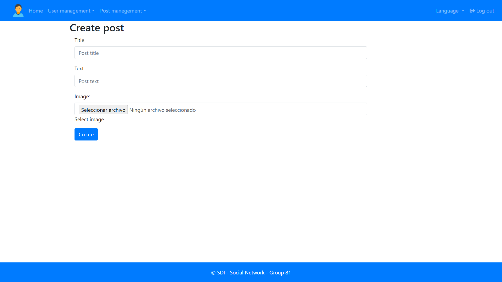

# MySocialNetwork
- [English](#english)
- [Español](#español)


# English
# My social network - SDI Practice (Group 81)
This is a web application for a social network that was developed as part of the Distributed Systems and Internet course at the School of Computer Engineering at the University of Oviedo.

It was created using Spring Boot, following the MVC (Model-View-Controller) architecture.

## 🛠️ Technologies Used

The project was developed using the following technologies and tools:

* **Backend:**
    * Java Development Kit (JDK) 17
    * Spring Boot 2.6.3
    * Spring Security
* **Frontend:**
    * Bootstrap 4.5.2
    * JQuery 3.5.1
    * Thymeleaf
* **Database:**
    * HSQLDB 2.6.1
* **Web Server:**
    * Apache Tomcat 9.0.41
  * **Testing:**
    * JUnit 5 (Junit-jupiter 5.8.1)
    * Selenium V.3.141.59
* **Platforms:**
    * IntelliJ IDEA ULTIMATE
    * GitHub

## ✨ Main Features

The platform has two user roles: **Standard User** and **Administrator**, each with different permissions.

### General Features

* **Internationalisation:** Application available in Spanish, English and French.
* **User Registration:** Allows you to create an account in the system.
* **Login:** Secure authentication system.

### Standard User Features

* **User Management:** Search and view a list of other users in the system (administrators remain hidden from standard users).
* **Friendship System:** Send, receive, and accept friend requests and view a list of current friends.
  * **Post Creation:** Create new posts with a title, text, and an optional image.
  * **Post Management:** View a list of all your own posts.
  * **Social Interaction:** View friends' profiles and posts and recommend their posts.

### Administrator Features

  * **Complete User List:** Complete list of all users, including other administrators.
  * **User Management:** Modify and delete any user from the system.
  * **Content Moderation:** List all posts on the platform and moderate them by changing their status (ACCEPTED, MODERATED, CENSORED).

-----

## 📸 Screenshots





-----

## 🚀 Execution

### Requirements

* JDK 17
* IntelliJ IDEA
* Git


### Installation and Execution

1.  Clone the repository on your local machine:
```sh
git clone https://github.com/UO285240/sdi2324-entrega1-81.git
```
2.  Open the project with IntelliJ IDEA.
3.  The project is configured to run with the Apache Tomcat server and the HSQLDB database. You need to run the HSQL database:
- Go to the hsqldb website https://sourceforge.net/projects/hsqldb/files/hsqldb/ and download version `hsqldb_2.6.1`.
    - Run the `hsqldb/bin/runServer.bat` file.

4.  Run the application's main class to start the server.
5.  The application will be available at `http://localhost:8090`.

### Test Users

The database is preloaded with users to facilitate testing. You can use the following credentials to log in:

| Role | Email | Password |
| :--- | :--- | :--- |
| **Administrator** | `admin@email.com` | `@Dm1n1str@Dor` |
| **Standard User** | `user01@email.com` | `Us3r@1-PASSW` |

-----

## 🧑‍💻 Authors

This project was developed by **Group 81** consisting of:
* **Rita Fernández-Catuxo Ortíz** (UO284185)
* **Javier Monteserin Rodríguez** (UO288524)
* **Rodrigo García Iglesias** (UO276396)
* **Coral Izquierdo Muñiz** (UO285240)


# Español

# My social network - Práctica SDI (Grupo 81)
Este proyecto es una aplicación web de una red social desarrollada para la asignatura Sistemas Distribuidos e Internet de la Escuela de Ingeniería Informática de la Universidad de Oviedo.

La aplicación se ha realizado con Spring Boot siguiendo la arquitectura MVC (Modelo-Vista-Controlador).

## 🛠️ Tecnologías Utilizadas

El proyecto fue desarrollado utilizando las siguientes tecnologías y herramientas:

  * **Backend:**
      * Java Development Kit (JDK) 17
      * Spring Boot 2.6.3
      * Spring Security
  * **Frontend:**
      * Bootstrap 4.5.2
      * JQuery 3.5.1
      * Thymeleaf
  * **Base de Datos:**
      * HSQLDB 2.6.1
  * **Servidor Web:**
      * Apache Tomcat 9.0.41
  * **Pruebas (Testing):**
      * JUnit 5 (Junit-jupiter 5.8.1)
      * Selenium V.3.141.59
  * **Plataformas:**
      * IntelliJ IDEA ULTIMATE
      * GitHub

## ✨ Características Principales

La plataforma tiene dos roles de usuario: **Usuario Estándar** y **Administrador**, cada uno con diferentes permisos.

### Características Generales

  * **Internacionalización:** Aplicación en los idiomas español, inglés y francés.
  * **Registro de Usuarios:** Permite crear una cuenta en el sistema.
  * **Inicio de Sesión:** Sistema de autenticación seguro.

### Funcionalidades de Usuario Estándar

  * **Gestión de Usuarios:** Buscar y ver una lista de otros usuarios en el sistema (los administradores permanecen ocultos para usuarios estándar).
  * **Sistema de Amistad:** Enviar, recibir y aceptar solicitudes de amistad y ver una lista de los amigos actuales.
  * **Creación de Publicaciones:** Crear nuevas publicaciones con título, texto y una imagen opcional.
  * **Gestión de Publicaciones:** Ver un listado de todas las publicaciones propias.
  * **Interacción Social:** Ver los perfiles y publicaciones de los amigos y recomendar sus publicaciones.

### Funcionalidades de Administrador

  * **Listado Completo de Usuarios:** Lista completa de todos los usuarios, incluyendo a otros administradores.
  * **Administración de Usuarios:** Modificar y eliminar cualquier usuario del sistema.
  * **Moderación de Contenido:** Lista de todas las publicaciones de la plataforma y moderarlas cambiando su estado (ACEPTADA, MODERADA, CENSURADA).

-----

## 📸 Capturas de Pantalla


-----

## 🚀 Ejecución

### Requisitos

  * JDK 17
  * IntelliJ IDEA
  * Git

### Instalación y Ejecución

1.  Clona el repositorio en tu máquina local:
    ```sh
    git clone https://github.com/UO285240/sdi2324-entrega1-81.git
    ```
2.  Abre el proyecto con IntelliJ IDEA.
3.  El proyecto está configurado para ejecutarse con el servidor Apache Tomcat y la base de datos HSQLDB. Es necesario ejecutar la base de datos HSQL:
    - Accedemos al sitio web de hsqldb https://sourceforge.net/projects/hsqldb/files/hsqldb/ y descargamos la versión `hsqldb_2.6.1`.
    - Ejecutar el fichero `hsqldb/bin/runServer.bat`.

4.  Ejecuta la clase principal de la aplicación para iniciar el servidor.
5.  La aplicación estará disponible en `http://localhost:8090`.

### Usuarios de Prueba

La base de datos está precargada con usuarios para facilitar las pruebas. Puedes usar las siguientes credenciales para iniciar sesión:

| Rol | Email | Contraseña |
| :--- | :--- | :--- |
| **Administrador** | `admin@email.com` | `@Dm1n1str@Dor` |
| **Usuario Estándar** | `user01@email.com` | `Us3r@1-PASSW` |

-----

## 🧑‍💻 Autores

Este proyecto fue desarrollado por el **Grupo 81** formado por:
  * **Rita Fernández-Catuxo Ortíz** (UO284185)
  * **Javier Monteserin Rodríguez** (UO288524)
  * **Rodrigo García Iglesias** (UO276396)
  * **Coral Izquierdo Muñiz** (UO285240)